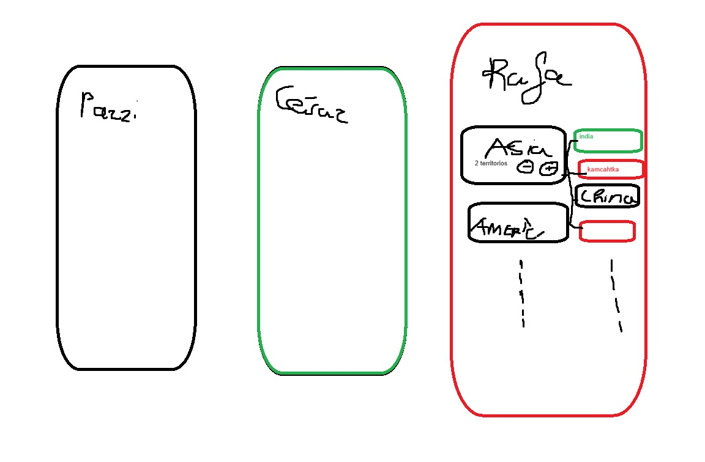

# Risk Manager

## Si usais VSCODE

### Requisitos 

Antes de abrir el proyecto en VS Code es necesario tener instalado:

- **Java JDK 21** (o compatible)
- **Gradle** (opcional, ya que el proyecto incluye Gradle Wrapper)
- **Visual Studio Code**

Extensiones recomendadas en VS Code:
- *Extension Pack for Java*
- *Gradle for Java*

---

### Ejecutar la aplicación

La forma recomendada de ejecutar la aplicación es **mediante Gradle**, para asegurar que JavaFX se carga correctamente.

./gradlew run
Este comando descargará las dependencias necesarias y lanzará la aplicación.

---

## Descripción del proyecto

Buscamos crear una aplicación en java para llevar el registro de cuantas tropas debemos añadirnos cada uno en cada turno de una partida de risk
según el número de territorios que tengamos y  el número de continentes que controlemos. La aplicación se basa en una serie de reglas predefinidas para calcular el número de tropas a añadir en cada turno.

---

## Tecnologías utilizadas

- **Java 21**
- **JavaFX** (interfaz gráfica)
- **Gradle** (gestión del proyecto y dependencias)
- **CSS JavaFX** (estilos de la aplicación)

---

## Estructura del proyecto

---

## Descripción de los componentes

### MainApp.java
Es el **punto de entrada de la aplicación**.  
Se encarga de:
- Inicializar JavaFX.
- Crear la escena principal.
- Cargar los estilos CSS.
- Mostrar la ventana principal.

No contiene lógica de la apliccacion.

---

### ui/
Contiene las clases relacionadas con la **interfaz**.

#### MainView.java
Define la vista principal de la aplicación:
- Campos de entrada del usuario.
- Botones de acción.
- Elementos visuales de salida (resultados).

La vista **NO implementa lógica** , solo recoge datos y muestra resultados.

---

### service/
**Contiene** la lógica del proyecto.

#### RiskService.java
Esta va a ser la clase principal de la lógica del proyecto.

---

### resources/
Contiene los recursos estáticos de la aplicación.

#### css/styles.css
Archivo de estilos CSS específico para JavaFX:
- Define la apariencia de botones, campos de texto y contenedores.
- Incluye estilos para modo claro y soporte para modo oscuro mediante clases.

#### images/
Carpeta destinada a iconos y recursos gráficos utilizados por la interfaz.

---

## CHANGELOG.md

Es un archivo donde vamos a ir registrando los cambios realizados en cada versión de la aplicación, incluyendo nuevas funcionalidades, correcciones de errores y mejoras.

El formato es el siguiente:

#### Día 20/02/2026
- Rafa - Cambio 1, He realizado la estructura de la aplicacion.
- Rafa - Cambio 2, He cambiado el changelog 
- Rafa - Cambio 3, He añadido el README.md
#### Dia...

---

### Gestión de Mapas
Para gestionar los mapas de Risk, se implementará una clase `MapManager` que se encargará de cargar y almacenar los mapas disponibles. Esta clase lee desde el archivo /resources/archives/mapas.txt, donde se encuentran los mapas en formato .txt. Cada mapa incluye información sobre los territorios, continentes y bonus.

---

## Tareas por realizar

- Implementar la ventana principal con JavaFX.
- Tener elección de diferentes Mapa de Risk.
- Implementar la lógica para leer el archivo de mapas y cargar los datos en la aplicación.
- Poder elegir el número de jugadores.
- Primero tendremos únicamente la opción de jugar todos en una misma pantalla. BOCETO: 

- Implementar la lógica de seleccionar de quien es el turno.
- Almacenar la partida.
- Llevar un registro de todas las partidas almacenado en el dispositivo.
- Tener opción de elegir si manejar la cantidad de tropas a añadir individual o colectivamente(debe ser una pantalla grande colectivamente).
- Implementar la lógica para poder jugar en diferentes dispositivos

---

## Estado actual

La aplicación se encuentra en una **fase inicial funcional**, con la infraestructura completamente preparada para el desarrollo de la aplicación.